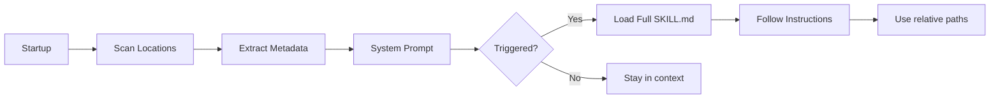

# Skills

Skills are self-contained capability packages that the agent loads on-demand. A skill provides specialized workflows, setup instructions, helper scripts, and reference documentation for specific tasks.

Pi implements the [Agent Skills standard](https://agentskills.io/specification), warning about violations but remaining lenient.

## Table of Contents

- [How Skills Work](#how-skills-work)
- [Locations](#locations)
- [Skill Structure](#skill-structure)
- [Frontmatter](#frontmatter)
- [String Substitutions](#string-substitutions)
- [Validation](#validation)
- [Skill Commands](#skill-commands)
- [Examples](#examples)
- [Built-in Skills](#built-in-skills)

## How Skills Work

Skills follow [Agent Skills](https://agentskills.io) standard với progressive disclosure:



| Level | When Loaded | Token Cost | Content |
|-------|------------|------------|---------|
| **Level 1: Metadata** | Always | ~100 tokens | `name` + `description` from YAML |
| **Level 2: Instructions** | When triggered | <5k tokens | SKILL.md body |
| **Level 3: Resources** | As needed | Unlimited | Bundled files, scripts |

**Loading flow:**
1. At startup, pi scans skill locations and extracts names and descriptions
2. System prompt includes available skills in XML format per the [specification](https://agentskills.io/integrate-skills)
3. When a task matches, the agent uses `read` to load the full SKILL.md
4. The agent follows instructions using relative paths for scripts and assets

## Locations

> **Security:** Skills can instruct the model to perform any action and may include executable code. Review skill content before use.

Pi loads skills from multiple locations:

| Location | Scope | Discovery |
|----------|-------|-----------|
| `~/.pi/agent/skills/` | Global | Root `.md` files + directories with `SKILL.md` |
| `~/.agents/skills/` | Global | Directories only (root `.md` ignored) |
| `.pi/skills/` | Project | Root `.md` files + directories |
| `.agents/skills/` | Project (walk up) | Directories only |
| `node_modules/*/skills/` | Package | In pi packages |
| Settings `skills[]` | Config | Via `settings.json` |
| CLI `--skill <path>` | Session | Additive even with `--no-skills` |

**Discovery rules:**
- In `~/.pi/agent/skills/` and `.pi/skills/`: direct root `.md` files are discovered as individual skills
- In all locations: directories containing `SKILL.md` are discovered recursively
- In `~/.agents/skills/` and `.agents/skills/`: root `.md` files are ignored

**Project-level search:** `.agents/skills/` searches from `cwd` up through parent directories until reaching git repo root, or filesystem root when not in a repo.

**Disable discovery:** Use `--no-skills` (explicit `--skill` paths still load).

### Using Skills from Other Harnesses

To use skills from Claude Code or OpenAI Codex:

**Global** (`~/.pi/agent/settings.json`):
```json
{
  "skills": [
    "~/.claude/skills",
    "~/.codex/skills"
  ]
}
```

**Project** (`.pi/settings.json`):
```json
{
  "skills": ["../.claude/skills"]
}
```

## Skill Structure

A skill is a directory containing a `SKILL.md` file. Everything else is freeform.

```
my-skill/
├── SKILL.md              # Required: frontmatter + instructions
├── scripts/              # Helper scripts
│   ├── setup.sh
│   └── process.sh
├── references/          # Detailed docs loaded on-demand
│   └── api-reference.md
└── assets/
    └── template.json
```

**Example tree:**
```
pi-code-review/
├── SKILL.md
├── templates/
│   ├── review-template.md
│   ├── checklist.md
│   └── severity-guide.md
└── scripts/
    └── validate.sh
```

## Frontmatter

Per the [Agent Skills specification](https://agentskills.io/specification#frontmatter-required):

### Required Fields

| Field | Type | Description |
|-------|------|-------------|
| `name` | string | 1-64 chars. Lowercase a-z, 0-9, hyphens only. Must match parent directory. |
| `description` | string | Max 1024 chars. What the skill does and when to use it. |

### Optional Fields

| Field | Type | Description |
|-------|------|-------------|
| `license` | string | License name or reference to bundled file |
| `compatibility` | string | Max 500 chars. Environment requirements |
| `metadata` | object | Arbitrary key-value mapping |
| `allowed-tools` | string | Space-delimited list of pre-approved tools (experimental) |
| `disable-model-invocation` | boolean | When `true`, skill hidden from system prompt. Users must use `/skill:name`. |

### Name Rules

- 1-64 characters
- Lowercase letters, numbers, hyphens only
- No leading/trailing hyphens
- No consecutive hyphens
- **Must match parent directory name exactly**

| Valid | Invalid | Reason |
|-------|---------|--------|
| `pdf-processing` | `PDF-Processing` | Uppercase not allowed |
| `code-review` | `-code-review` | Leading hyphen |
| `api-tools` | `api--tools` | Consecutive hyphens |
| `skill123` | `skill-` | Trailing hyphen |

### Description Best Practices

The description determines when the agent loads the skill. Be specific.

**Good:**
```yaml
description: Extracts text and tables from PDF files, fills PDF forms, and merges multiple PDFs. Use when working with PDF documents.
```

**Poor:**
```yaml
description: Helps with PDFs.
```

## String Substitutions

Skills can use variable substitutions that pi resolves at load time:

| Variable | Description | Example |
|----------|-------------|---------|
| `$ARGUMENTS` | All arguments passed when invoking skill | `/skill:pdf-tools extract file.pdf` → `$ARGUMENTS` = "extract file.pdf" |
| `${PI_SKILL_DIR}` | Full path to skill directory | Useful for referencing bundled files |
| `` !`command` `` | Run shell command and inline output | ``!`git rev-parse HEAD` `` |

**Example with substitutions:**
```markdown
---
name: deploy
description: Deploy application to production environment.
---

# Deploy Skill

## Configuration
Working directory: `${PI_SKILL_DIR}`
Current commit: !`git rev-parse HEAD`

## Usage
Arguments passed: $ARGUMENTS
```

## Validation

Pi validates skills against the Agent Skills standard. Most issues produce warnings but still load:

| Issue | Severity | Effect |
|-------|----------|--------|
| Name doesn't match parent directory | Warning | Still loads |
| Name > 64 characters | Warning | Still loads |
| Name with invalid characters | Warning | Still loads |
| Name starts/ends with hyphen | Warning | Still loads |
| Name has consecutive hyphens | Warning | Still loads |
| Description > 1024 characters | Warning | Still loads |
| Missing description | **Error** | **Not loaded** |

Name collisions (same name from different locations) warn and keep the first skill found.

## Skill Commands

Skills register as `/skill:name` commands:

```bash
/skill:brave-search           # Load and execute
/skill:pdf-tools extract      # Load with arguments
/skill:code-review @file.ts   # Load with file argument
```

**How it works:**
1. User types `/skill:name [args]`
2. pi loads the skill's SKILL.md
3. Arguments after the command are appended as `User: <args>`
4. Agent follows skill instructions

**Toggle skill commands:**
```json
// settings.json
{
  "enableSkillCommands": true
}
```

Or via `/settings` in interactive mode.

## Examples

### Minimal Skill

```
hello-world/
└── SKILL.md
```

**SKILL.md:**
```yaml
---
name: hello-world
description: Prints a greeting. Use when asking for hello or greeting.
---

# Hello World

Say hello to the user with a friendly message.
```

### Full Featured Skill

```
deploy/
├── SKILL.md
├── scripts/
│   ├── build.sh
│   └── deploy.sh
├── templates/
│   └── config.yaml
└── README.md
```

**SKILL.md:**
```yaml
---
name: deploy
description: Deploys the application to production. Use when asking to deploy, release, or ship.
license: MIT
compatibility: Node.js 18+, Docker
metadata:
  version: 1.0.0
  author: team
---

# Deploy Skill

## Prerequisites
- Docker installed
- kubectl configured
- Access to production cluster

## Setup
Run once before first use:
```bash
cd ${PI_SKILL_DIR}
npm install
```

## Workflow
1. Run tests: `./scripts/build.sh test`
2. Build image: `./scripts/build.sh image`
3. Deploy: `./scripts/deploy.sh prod`

## Rollback
If deployment fails:
```bash
./scripts/deploy.sh rollback
```

See [README.md](README.md) for detailed documentation.
```

## Built-in Skills

Pi ships with these built-in skills:

| Skill | Mô Tả | Khi Nào Dùng |
|-------|-------|-------------|
| `/skill:kn-init` | Initialize task | Bắt đầu task mới |
| `/skill:kn-plan` | Create implementation plan | Lập kế hoạch |
| `/skill:kn-research` | Research before planning | Nghiên cứu trước khi plan |
| `/skill:kn-spec` | Create spec for complex features | Viết spec |
| `/skill:kn-implement` | Implement after plan approved | Thực thi plan |
| `/skill:kn-verify` | Verify implementation | Kiểm tra sau implement |
| `/skill:kn-review` | Code review | Review code |
| `/skill:kn-doc` | Documentation | Viết docs |
| `/skill:kn-commit` | Commit workflow | Commit changes |
| `/skill:kn-debug` | Debugging | Debug issues |
| `/skill:kn-extract` | Extract code | Tách code |
| `/skill:kn-template` | Templates | Sử dụng template |
| `/skill:kn-go` | Navigation | Di chuyển trong codebase |

### Example Skill Workflows

**Standard development flow:**
```
kn-init → kn-plan → kn-research (optional) → kn-spec (optional) → kn-implement → kn-verify → kn-doc → kn-commit
```

**Debug flow:**
```
kn-debug → identify → fix → kn-verify
```

**Code review flow:**
```
kn-review → feedback → implement fixes → kn-review
```

## Skill Repositories

- [Anthropic Skills](https://github.com/anthropics/skills) - Document processing (docx, pdf, pptx, xlsx), web development
- [Pi Skills](https://github.com/badlogic/pi-skills) - Web search, browser automation, Google APIs, transcription

## Related

- [Extensions](../04-extensions/README.md) - Custom tools and commands
- [Settings](../09-settings/README.md) - Skill configuration
- [pi docs](https://pi.dev) - Official documentation
