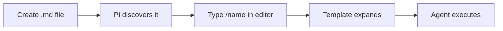

# Prompt Templates

Prompt templates are reusable Markdown snippets that expand into full prompts. Type `/name` in the editor to invoke a template, where `name` is the filename without `.md`.

Think of them as **macros for your most common requests**.

## Table of Contents

- [How It Works](#how-it-works)
- [Locations](#locations)
- [Format](#format)
- [Arguments](#arguments)
- [Usage](#usage)
- [Examples](#examples)
- [Tips](#tips)

## How It Works



1. You create a `.md` file with a description and instructions
2. Pi auto-discovers it at startup
3. You type `/filename` — it expands into a full prompt
4. The agent follows the instructions as if you typed them

## Locations

Pi loads prompt templates from:

| Location | Scope |
|----------|-------|
| `~/.pi/agent/prompts/*.md` | Global (all projects) |
| `.pi/prompts/*.md` | Project-specific |
| Packages | Via `prompts/` or `pi.prompts` in `package.json` |
| Settings | `prompts` array in `settings.json` |
| CLI | `--prompt-template <path>` (repeatable) |

**Discovery is non-recursive** — only root `.md` files in the prompts directory are found. For subdirectories, add them explicitly via settings.

Disable discovery with `--no-prompt-templates`.

## Format

A template is a Markdown file with optional YAML frontmatter:

```markdown
---
description: Review staged git changes
---
Review the staged changes (`git diff --cached`). Focus on:
- Bugs and logic errors
- Security issues
- Error handling gaps
```

- **Filename** becomes the command name: `review.md` → `/review`
- **`description`** is optional. If missing, the first non-empty line is used
- **Body** is the prompt that gets sent to the agent

## Arguments

Templates support positional arguments:

| Syntax | Meaning |
|--------|---------|
| `$1`, `$2`, ... | Positional argument |
| `$@` or `$ARGUMENTS` | All arguments joined |
| `${@:N}` | All arguments from position N |
| `${@:N:L}` | L arguments starting at position N |

Example template (`component.md`):

```markdown
---
description: Create a React component
---
Create a React component named $1 with these features: ${@:2}
```

Usage:

```
/component Button "onClick handler" "disabled support"
```

Expands to:
> Create a React component named Button with these features: onClick handler disabled support

## Usage

Type `/` followed by the template name. Autocomplete shows available templates with descriptions.

```
/review                              # No arguments
/component Button                    # One argument
/component Button "click handler"    # Multiple arguments
```

## Examples

### Code Review (`review.md`)

```markdown
---
description: Review staged git changes for bugs and issues
---
Review the staged changes (`git diff --cached`). Focus on:
- Bugs and logic errors
- Security issues
- Error handling gaps
- Performance concerns

Be concise. Only flag real problems.
```

### Commit Message (`commit.md`)

```markdown
---
description: Generate a commit message from staged changes
---
Look at the staged changes (`git diff --cached`) and write a conventional commit message.

Format: `type(scope): description`

Types: feat, fix, docs, refactor, test, chore

Keep the subject line under 72 characters. Add a body only if the change is non-trivial.
```

### Translate (`translate.md`)

```markdown
---
description: Translate a file to another language
---
Translate the file $1 to $2.

Rules:
- Keep all code blocks, links, and formatting unchanged
- Keep technical terms in English where appropriate
- Natural, fluent translation — not word-by-word
```

Usage: `/translate README.md Vietnamese`

### Explain (`explain.md`)

```markdown
---
description: Explain a file or concept
---
Explain $@ in simple terms.

- Start with a one-sentence summary
- Then break down the key parts
- Use analogies if helpful
- Keep it under 200 words
```

Usage: `/explain the session tree branching model`

### Test (`test.md`)

```markdown
---
description: Write tests for a file
---
Write tests for `$1`.

- Use the existing test framework in this project
- Cover happy path, edge cases, and error cases
- Keep tests focused and independent
- Use descriptive test names
```

Usage: `/test src/utils/parser.ts`

## Tips

- **Keep templates short** — the agent works best with clear, focused instructions
- **Use project templates** (`.pi/prompts/`) for project-specific workflows
- **Use global templates** (`~/.pi/agent/prompts/`) for personal shortcuts
- **Combine with skills** — a template can reference a skill: "Use the `/skill:code-review` workflow"
- **No restart needed** — templates reload when you open the autocomplete menu
- **Share with team** — put `.pi/prompts/` in version control
- **Disable in headless** — use `--no-prompt-templates` to skip template discovery (explicit `--prompt-template` paths still load)
- **Argument syntax** — templates use `$1`, `$2`, `$@` etc. for positional arguments. Some documentation may reference `{{name}}` placeholders — the canonical syntax is the shell-style `$N` form
