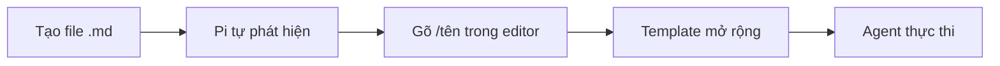

# Prompt Templates

Prompt template là các file Markdown tái sử dụng, mở rộng thành prompt đầy đủ. Gõ `/tên` trong editor để gọi template, trong đó `tên` là tên file không có `.md`.

Hiểu đơn giản: **macro cho các yêu cầu bạn hay dùng nhất**.

## Mục lục

- [Cách hoạt động](#cách-hoạt-động)
- [Vị trí lưu trữ](#vị-trí-lưu-trữ)
- [Định dạng](#định-dạng)
- [Tham số](#tham-số)
- [Cách dùng](#cách-dùng)
- [Ví dụ thực tế](#ví-dụ-thực-tế)
- [Mẹo hay](#mẹo-hay)

## Cách hoạt động



1. Bạn tạo file `.md` với mô tả và hướng dẫn
2. Pi tự phát hiện khi khởi động
3. Bạn gõ `/tên-file` — nó mở rộng thành prompt đầy đủ
4. Agent làm theo hướng dẫn như bạn tự gõ

## Vị trí lưu trữ

| Vị trí | Phạm vi |
|--------|---------|
| `~/.pi/agent/prompts/*.md` | Toàn cục (mọi project) |
| `.pi/prompts/*.md` | Riêng cho project |
| Packages | Qua `prompts/` hoặc `pi.prompts` trong `package.json` |
| Settings | Mảng `prompts` trong `settings.json` |
| CLI | `--prompt-template <path>` (lặp được) |

**Chỉ quét file gốc** — không đệ quy vào thư mục con. Muốn thêm thư mục con thì khai báo trong settings.

Tắt hoàn toàn bằng `--no-prompt-templates`.

## Định dạng

File Markdown với YAML frontmatter (tùy chọn):

```markdown
---
description: Review staged git changes
---
Review the staged changes (`git diff --cached`). Focus on:
- Bugs and logic errors
- Security issues
- Error handling gaps
```

- **Tên file** thành tên lệnh: `review.md` → `/review`
- **`description`** tùy chọn. Nếu không có, dùng dòng đầu tiên
- **Body** là prompt gửi cho agent

## Tham số

Template hỗ trợ tham số vị trí:

| Cú pháp | Ý nghĩa |
|---------|---------|
| `$1`, `$2`, ... | Tham số theo vị trí |
| `$@` hoặc `$ARGUMENTS` | Tất cả tham số nối lại |
| `${@:N}` | Tham số từ vị trí N trở đi |
| `${@:N:L}` | L tham số bắt đầu từ vị trí N |

Ví dụ template (`component.md`):

```markdown
---
description: Tạo React component
---
Tạo React component tên $1 với các tính năng: ${@:2}
```

Cách dùng:

```
/component Button "onClick handler" "disabled support"
```

## Cách dùng

Gõ `/` rồi tên template. Autocomplete sẽ hiện danh sách có mô tả.

```
/review                              # Không tham số
/component Button                    # Một tham số
/component Button "click handler"    # Nhiều tham số
```

## Ví dụ thực tế

### Review code (`review.md`)

```markdown
---
description: Review staged git changes
---
Review the staged changes (`git diff --cached`). Tập trung vào:
- Bug và lỗi logic
- Vấn đề bảo mật
- Thiếu xử lý lỗi
- Hiệu năng

Ngắn gọn. Chỉ báo vấn đề thật sự.
```

### Commit message (`commit.md`)

```markdown
---
description: Tạo commit message từ staged changes
---
Xem staged changes (`git diff --cached`) và viết conventional commit message.

Format: `type(scope): mô tả`

Types: feat, fix, docs, refactor, test, chore

Subject line dưới 72 ký tự. Body chỉ khi thay đổi phức tạp.
```

### Dịch file (`translate.md`)

```markdown
---
description: Dịch file sang ngôn ngữ khác
---
Dịch file $1 sang $2.

Quy tắc:
- Giữ nguyên code block, link, formatting
- Thuật ngữ kỹ thuật giữ tiếng Anh khi phù hợp
- Dịch tự nhiên, không dịch từng từ
```

Dùng: `/translate README.md Vietnamese`

### Giải thích (`explain.md`)

```markdown
---
description: Giải thích file hoặc khái niệm
---
Giải thích $@ đơn giản.

- Tóm tắt 1 câu
- Phân tích các phần chính
- Dùng ví dụ nếu cần
- Dưới 200 từ
```

### Viết test (`test.md`)

```markdown
---
description: Viết test cho file
---
Viết test cho `$1`.

- Dùng test framework có sẵn trong project
- Cover happy path, edge case, error case
- Test độc lập, tên mô tả rõ ràng
```

Dùng: `/test src/utils/parser.ts`

## Mẹo hay

- **Giữ template ngắn** — agent làm tốt nhất với hướng dẫn rõ ràng, tập trung
- **Template project** (`.pi/prompts/`) cho workflow riêng project
- **Template global** (`~/.pi/agent/prompts/`) cho shortcut cá nhân
- **Kết hợp với skill** — template có thể gọi skill: "Dùng `/skill:code-review`"
- **Không cần restart** — template reload khi mở autocomplete
- **Chia sẻ với team** — commit `.pi/prompts/` vào repo
